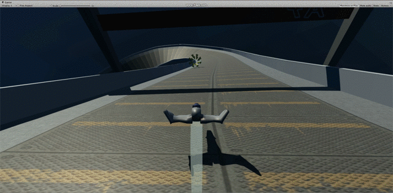
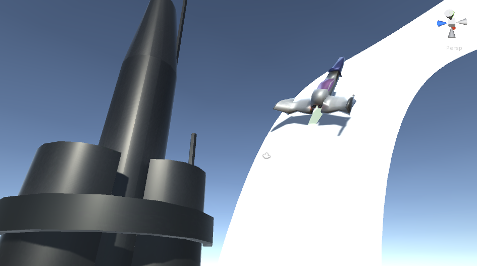

# ThridPersonPaperEngine
Code for various types of player manipulation with a third person camera. 

The main focus is recreating the intense, high speed, antigravity physics in the 2003 Gamecube game F Zero GX.

 

Showcasing the racing machine with some other primitive assets.

 

In game thrid person screenshot of the machine on the anti-grav track.

##TODO:
* Add AI
* Fog in the distance
* Add enum class for RacePlayer status
* Fix issue with car clipping through track, hard to recreate. Alternatively just don't have too hardly sloped tracks.

